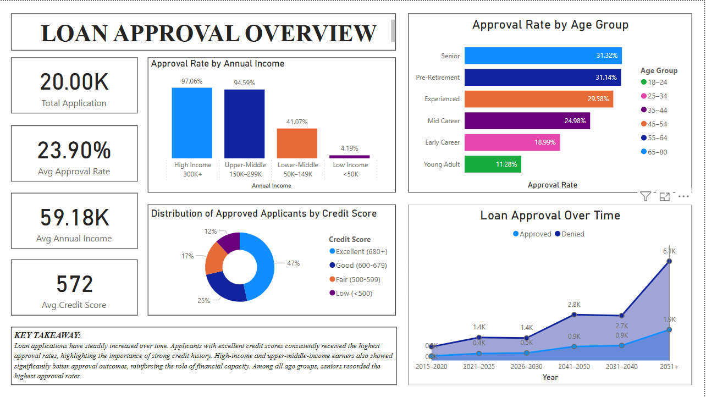
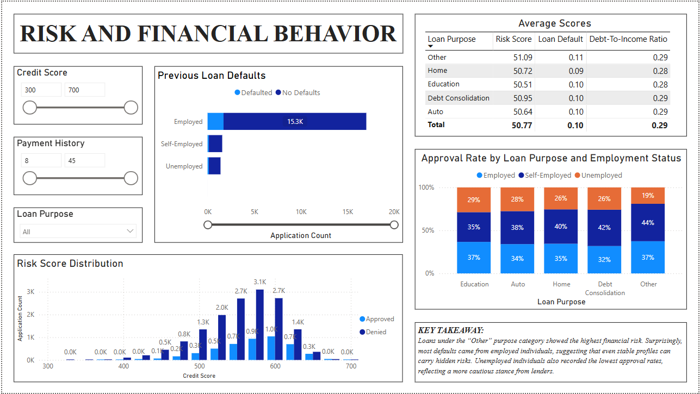
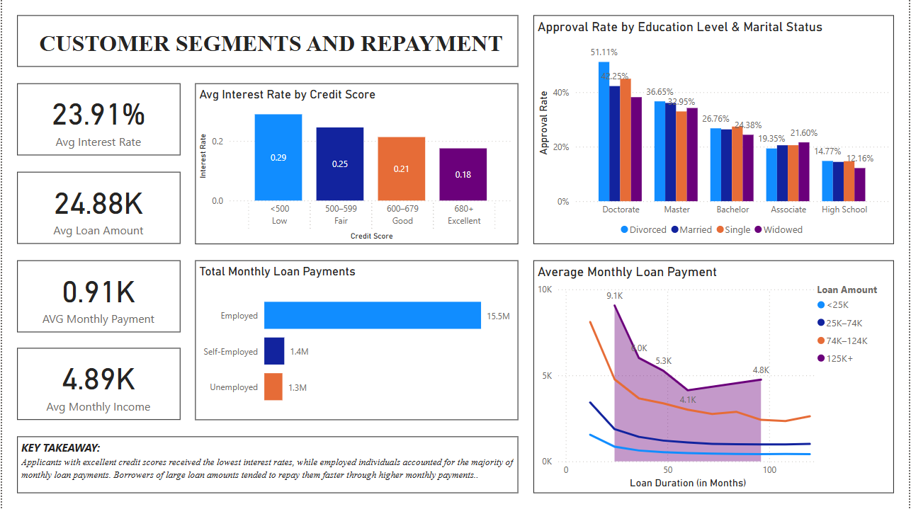

# 🧾 Bank Loan Approval & Risk Analysis Dashboard with POWERBI

## 📌 Overview
•	This project analyzes historical bank loan application data to uncover insights about loan approvals, customer risk, and financial patterns. It uses Power BI to help banks make data-driven decisions in loan processing and risk evaluation.

The dashboard consists of **3 interactive pages**:

1. **Loan Approval Overview**
2. **Risk & Financial Behavior**
3. **Customer Segments & Repayment**

---

## 📊 Dashboard Preview

| Loan Approval Overview | Risk & Financial Behavior | Customer Segments & Repayment |
|------------------------|---------------------------|-------------------------------|
|  |  |  |

---

## 🔍 Key Questions Answered

### Page 1: Loan Approval Overview
•	How many loan applications were submitted in total?
•	What is the average approval rate across all applications?
•	What are the average financial traits of the applicants?
•	How does annual income impact loan approval rate?
•	What credit score ranges are most common among approved applicants?
•	Which age groups have higher or lower approval rates?
•	How have application and approval trends changed over the years?

### Page 2: Risk & Financial Behavior
•	Which employment statuses have the highest number of previous loan defaults?
•	What is the approval rate across different loan purposes when segmented by employment status?
•	What’s the average risk score, default count, and debt-to-income ratio for each loan purpose?
•	How does credit score affect loan approvals and denials?

### Page 3: Customer Segments & Repayment
•	What are the average loan terms across the applicant pool?
•	How does credit score influence the interest rate offered?
•	Which employment status group contributes the most to total monthly loan payments?
•	How do education level and marital status affect approval rates?
•	Which loan amount categories carry the highest monthly payment obligations?

---

## 📁 Deliverables

- `4th Portfolio - Bank Loan Approval & Risk Analysis Dashboard with Power BI.pbix` – Power BI dashboard file
- `4th Portfolio - Bank Loan Approval & Risk Analysis Dashboard with Power BI.docx` – Written analysis, business questions, and key takeaways
- `/images` – Visual previews of the dashboard

---

## 👤 About Me
I'm an aspiring data analyst with a strong focus on financial and risk analytics. This project is part of my data portfolio to demonstrate skills in:
- Data cleaning
- DAX and measures
- Visual storytelling
- Business insight generation

Feel free to connect with me on [LinkedIn](https://www.linkedin.com/in/marktheanalyst103/) or contact me via [email](mailto:marktheanalyst103@gmail.com).

